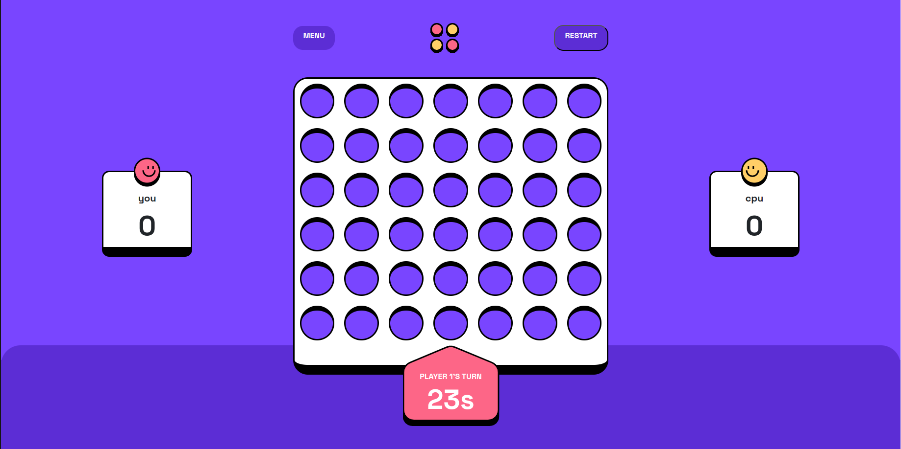

# Connect Four Game

Welcome to the Connect Four game! This project allows you to play the classic Connect Four game against another human player on the same computer.



## Table of Contents

- [Getting Started](#getting-started)
  - [Prerequisites](#prerequisites)
  - [Installation](#installation)
- [How to Play](#how-to-play)
- [Game Rules](#game-rules)
- [Optimal Layout](#optimal-layout)
- [Interactive Elements](#interactive-elements)
- [Bonus Features](#bonus-features)
- [Credits](#credits)

## Getting Started

### Prerequisites

To run this project, you need to have Node.js installed on your system.

### Installation

1. Clone this repository to your local machine:

   ```bash
   git clone <repository-url>
   ```

2. Navigate to the project directory:

   ```bash
   cd connect-four-game
   ```

3. Install dependencies:

   ```bash
   npm install
   ```

4. Start the development server:

   ```bash
   npm run dev
   ```

5. Open your browser and navigate to `http://localhost:3000` to view the game.

## How to Play

1. When the game starts, you'll see the game board with empty slots.
2. Players take turns to drop their colored discs into the columns of the board.
3. The first player to connect four of their colored discs in a row wins the game.
4. If the board fills up before a player achieves four in a row, the game is a draw.

## Game Rules

Connect Four is played on a vertical grid with 7 columns and 6 rows. Players alternate turns, dropping one of their colored discs into an empty column. The discs fall straight down, occupying the lowest available space within the column.

To win, you must be the first player to connect four of your colored discs in a row, either horizontally, vertically, or diagonally.

## Optimal Layout

The game interface is responsive, adapting to different screen sizes for optimal viewing and interaction. Whether you're playing on a desktop or a mobile device, you'll have a smooth gaming experience.

## Interactive Elements

- **Game Board**: Click on any empty slot in the column to drop your disc.
- **Reset Button**: Resets the game to its initial state, allowing you to start a new game.
- **Game Rules Button**: Provides a brief overview of the game rules.

## Bonus Features

- **Disc Animation**: Discs animate into their position when a move is made.
- **Play Against Computer**: Coming soon!

## Connect with me:

Feel free to connect with me on the following platforms to discuss, ask questions, or just say hello:

- [CodePen](https://codepen.io/abayizera-sam-eazi)
- [Twitter](https://twitter.com/abayizerasam)
- [LinkedIn](https://linkedin.com/in/abayizera-samuel)
- [Instagram](https://instagram.com/abayizera7)
- [HackerRank](https://www.hackerrank.com/abayizeraeaz)

## Credits

This project was created by ABAYIZERA Samuel. It utilizes React.js and Vite for development. Connect Four game logic is implemented in JavaScript.
